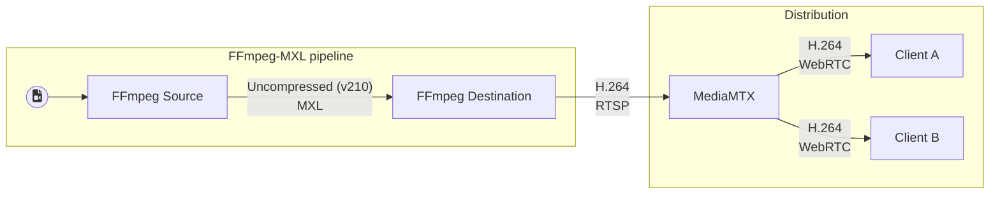

# Demos



Video only.

## Startup the services

```bash
docker compose up -d 
```

Open browser @ `http://<servirIP>:8889/mxlstream`

## Inspect the domain

```bash
docker volume inspect demos_mxl-domain | grep Mountpoint                                                              ✔  17:06:54 
        "Mountpoint": "/var/lib/docker/volumes/demos_mxl-domain/_data",
sudo find /var/lib/docker/volumes/demos_mxl-domain/_data
...
```

## Close

```bash
docker compose down
```
