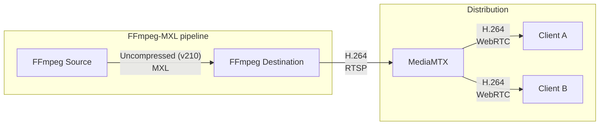

# Demos


```mermaid
graph LR
    subgraph "FFmpeg-MXL pipeline"
    A[FFmpeg Source] -- "Uncompressed (v210)<br/> MXL" --> B[FFmpeg Destination]
    end

    subgraph "Distribution"
    B -- "H.264<br/> RTSP" --> C[MediaMTX]
    C -- "H.264<br/> WebRTC" --> D[Client A]
    C -- "H.264<br/> WebRTC" --> E[Client B]
    end
```

Video only.

## Startup

```bash
docker compose up
```

Open browser @ `http://<servirIP>:8889/mxlstream`

## Close

```bash
docker compose down
```
