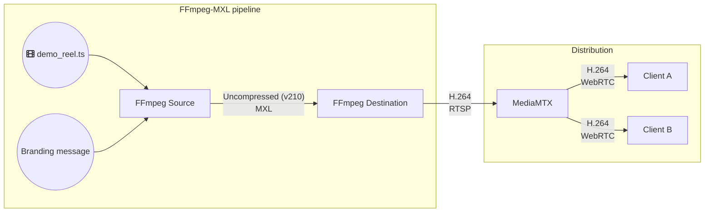

# Demos



Video only.

## Startup the services

```bash
docker compose up -d 
```

## Monitor

Open browser @ `http://<serverIP>:8889/mxlstream`

## Troubleshoot

```bash
docker compose logs -f # watch for retstarting services

sudo netstat -laputen | grep -E "8889|8554" # show socket status

find /dev/shm/ffmpeg # ls flow content
```

## Close

```bash
docker compose down
```
