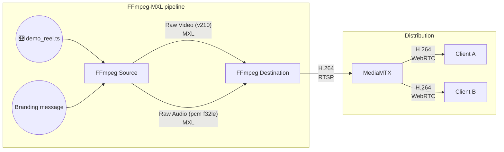

# Demos



## Startup the services

```bash
cd <demo_dir>
export MEDIAMTX_HOST=X.X.X.X # default is 127.0.0.1
docker compose up -d 
```

## Monitor

Open browser @ `http://${MEDIAMTX_HOST:-127.0.0.1}:8889/ffmpeg`

## Troubleshoot from the host

Inspect individual essences:
- video: `http://${MEDIAMTX_HOST:-127.0.0.1}:8889/ffmpeg-v`
- audio: `http://${MEDIAMTX_HOST:-127.0.0.1}:8889/ffmpeg-a`

```bash
# watch for restarting services
docker compose logs -f

# inspect socket status
sudo netstat -laputen | grep -E "8889|8554"

# inspect domain files
find /dev/shm/ffmpeg
```

## Close

```bash
docker compose down
```
