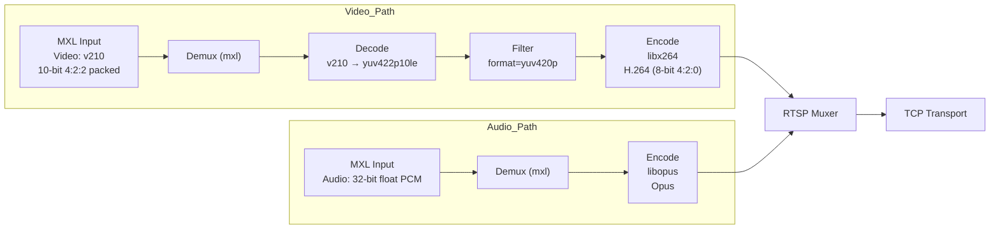
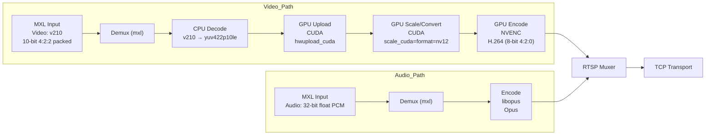

# FFmpeg/MXL Streaming

This page describes using FFmpeg/MXL to implement low latency
streaming using H.264 video, Opus audio, and RTSP transport. FFmpeg
actions as the RTSP client.

## CPU H.264 Encoding

This command reads MXL video in `v210` (10-bit 4:2:2) format and MXL
audio in 32-bit float PCM from shared memory ring buffers, converts
the video to `yuv420p`, encodes the video in software on the CPU using
`libx264` and the audio with `libopus`, and publishes the resulting
H.264/Opus stream to an RTSP server over TCP.

```
./ffmpeg -hide_banner -nostats -loglevel warning -debug_ts \
      -threads 1 -f mxl -i /dev/shm/mxl/aa1fcb2a-82cc-4135-8cdf-3e67a7e0a834.mxl-flow \
      -f mxl -on_too_late 0 -max_audio_samples_per_read 400 -i /dev/shm/mxl/7ba004db-2a56-4c44-9d48-f7d3e6365716.mxl-flow \
      -map 0:v:0 -map 1:a:0 \
      -vf format=yuv420p \
      -c:v libx264 \
      -preset superfast \
      -tune zerolatency \
      -bf 0 \
      -rc-lookahead 0 \
      -g 30 \
      -sc_threshold 0 \
      -crf 20 \
      -x264-params "sliced-threads=1:sync-lookahead=0" \
      -maxrate 12M -bufsize 1M \
      -threads 4 \
      -c:a libopus -b:a 128k -application lowdelay -frame_duration 10 \
      -f rtsp -rtsp_transport tcp \
      rtsp://your.rtsp.server.lan:port/test_stream
```



## GPU H.264 Encoding

This command reads MXL video in `v210` (10-bit 4:2:2) format and MXL
audio in 32-bit float PCM from shared memory ring buffers, uploads the
video to the GPU and converts it to `nv12` using CUDA filters
(`hwupload_cuda,scale_cuda`), encodes the video in hardware using
`h264_nvenc` with low-latency CBR settings (no B-frames, fixed GOP, no
lookahead), encodes the audio with `libopus`, and publishes the
resulting H.264/Opus stream to an RTSP server over TCP.

```
./ffmpeg -hide_banner -nostats -loglevel warning -debug_ts \
    -threads 1 -f mxl -i /dev/shm/mxl/aa1fcb2a-82cc-4135-8cdf-3e67a7e0a834.mxl-flow \
	-f mxl -on_too_late 1 -max_audio_samples_per_read 400 -i /dev/shm/mxl/7ba004db-2a56-4c44-9d48-f7d3e6365716.mxl-flow \
	-map 0:v:0 -map 1:a:0 \
	-vf "hwupload_cuda,scale_cuda=format=nv12:interp_algo=nearest" \
	-c:v h264_nvenc \
	-pix_fmt cuda \
	-profile:v high \
	-preset p3 \
	-tune ull \
	-zerolatency 1 \
	-delay 0 \
	-bf 0 \
	-g 30 \
	-rc cbr \
	-ldkfs 1 \
	-b:v 20M \
	-maxrate 20M \
	-bufsize 1M \
	-rc-lookahead 0 \
	-surfaces 8 \
	-spatial-aq 1 \
	-temporal-aq 0 \
	-c:a libopus -b:a 128k -application lowdelay -frame_duration 10 \
	-f rtsp -rtsp_transport tcp \
    rtsp://your.rtsp.server.lan:port/test_stream
```


