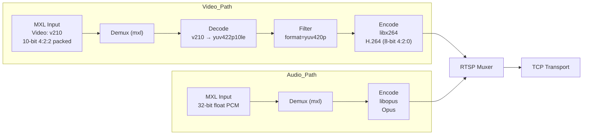
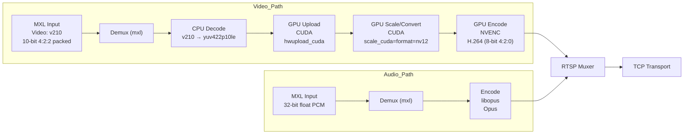

# FFmpeg/MXL Streaming

This page describes using FFmpeg/MXL to implement low latency
streaming using H.264 video, Opus audio, and RTSP transport. FFmpeg
actions as the RTSP client.

## CPU H.264 Encoding

This command reads MXL video in `v210` (10-bit 4:2:2) format and MXL
audio in 32-bit float PCM from shared memory ring buffers, converts
the video to `yuv420p`, encodes the video in software on the CPU using
`libx264` and the audio with `libopus`, and publishes the resulting
H.264/Opus stream to an RTSP server over TCP.

```
./ffmpeg -hide_banner -nostats -loglevel warning -debug_ts \
      -threads 1 -f mxl -i /dev/shm/mxl/aa1fcb2a-82cc-4135-8cdf-3e67a7e0a834.mxl-flow \
      -f mxl -on_too_late 0 -max_audio_samples_per_read 400 -i /dev/shm/mxl/7ba004db-2a56-4c44-9d48-f7d3e6365716.mxl-flow \
      -map 0:v:0 -map 1:a:0 \
      -vf format=yuv420p \
      -c:v libx264 \
      -preset superfast \
      -tune zerolatency \
      -bf 0 \
      -rc-lookahead 0 \
      -g 30 \
      -sc_threshold 0 \
      -crf 20 \
      -x264-params "sliced-threads=1:sync-lookahead=0" \
      -maxrate 12M -bufsize 1M \
      -threads 4 \
      -c:a libopus -b:a 128k -application lowdelay -frame_duration 10 \
      -f rtsp -rtsp_transport tcp \
      rtsp://your.rtsp.server.lan:port/test_stream
```

> [!IMPORTANT]
> The `-threads 1` option before the video demuxer (`-f mxl ...`) is
> important. By default FFmpeg will create one decode thread per
> available CPU, up to a maximum of 16 threads, and will insert one
> frame of delay for each decode stage thread. In the 16-thread case,
> this will introduce 500 ms of delay. A single thread is sufficient for
> the decode stage.



| Option | Description | Effect |
|--------|------------|--------|
| `-c:v libx264` | Select x264 encoder | CPU-based H.264 encoding |
| `-preset superfast` | Encoder speed/quality preset | Prioritizes speed over compression efficiency |
| `-tune zerolatency` | Low-latency profile | Disables buffering that increases latency |
| `-bf 0` | Disable B-frames | Eliminates frame reordering latency |
| `-rc-lookahead 0` | Disable rate-control lookahead | Prevents future-frame analysis buffering and latency |
| `-g 30` | GOP size (keyframe interval) | Inserts a keyframe every 30 frames |
| `-sc_threshold 0` | Disable scene-change keyframes | Keeps GOP structure fixed and predictable |
| `-crf 20` | Constant Rate Factor setting | Higher quality than default (x264 default is 23). |
| `-x264-params "sliced-threads=1:sync-lookahead=0"` | Additional x264 parameters | Enables slice-based threading and disables frame synchronization lookahead to reduce encoder latency |
| `-maxrate 12M` | Maximum bitrate | Caps peak bitrate at 12 Mbps |
| `-bufsize 1M` | Encoder buffer size | Limits bitrate spikes and buffering |
| `-threads 4` | Encoder thread count | Uses 4 CPU threads for encoding |


## GPU H.264 Encoding

This command reads MXL video in `v210` (10-bit 4:2:2) format and MXL
audio in 32-bit float PCM from shared memory ring buffers, uploads the
video to the GPU and converts it to `nv12` using CUDA filters
(`hwupload_cuda,scale_cuda`), encodes the video in hardware using
`h264_nvenc` with low-latency CBR settings (no B-frames, fixed GOP, no
lookahead), encodes the audio with `libopus`, and publishes the
resulting H.264/Opus stream to an RTSP server over TCP.

```
./ffmpeg -hide_banner -nostats -loglevel warning -debug_ts \
    -threads 1 -f mxl -i /dev/shm/mxl/aa1fcb2a-82cc-4135-8cdf-3e67a7e0a834.mxl-flow \
	-f mxl -on_too_late 1 -max_audio_samples_per_read 400 -i /dev/shm/mxl/7ba004db-2a56-4c44-9d48-f7d3e6365716.mxl-flow \
	-map 0:v:0 -map 1:a:0 \
	-vf "hwupload_cuda,scale_cuda=format=nv12:interp_algo=nearest" \
	-c:v h264_nvenc \
	-pix_fmt cuda \
	-profile:v high \
	-preset p3 \
	-tune ull \
	-zerolatency 1 \
	-delay 0 \
	-bf 0 \
	-g 30 \
	-rc cbr \
	-ldkfs 1 \
	-b:v 20M \
	-maxrate 20M \
	-bufsize 1M \
	-rc-lookahead 0 \
	-surfaces 2 \
	-spatial-aq 1 \
	-temporal-aq 0 \
	-c:a libopus -b:a 128k -application lowdelay -frame_duration 10 \
	-f rtsp -rtsp_transport tcp \
    rtsp://your.rtsp.server.lan:port/test_stream
```



| Option | Description | Effect |
|--------|------------|--------|
| `-vf "hwupload_cuda,...` | CUDA filter chain | Uploads frames to GPU and converts to `nv12` |
| `-c:v h264_nvenc` | Select NVENC encoder | GPU-based H.264 encoding |
| `-pix_fmt cuda` | Use CUDA hardware frames | Keeps frames in GPU memory for encoding |
| `-profile:v high` | H.264 High profile | Enables standard High profile coding tools |
| `-preset p3` | NVENC preset | Performance/quality tradeoff preset |
| `-tune ull` | Ultra-low-latency tuning | Minimizes internal encoder buffering |
| `-zerolatency 1` | Zero-latency mode | Enabled; minimizes internal encoder buffering |
| `-delay 0` | Output delay setting | Set to 0; prevents additional encoder frame buffering |
| `-bf 0` | Disable B-frames | Eliminates frame reordering delay |
| `-g 30` | GOP size | Sets keyframe interval to 30 frames |
| `-rc cbr` | Constant bitrate mode | Maintains fixed output bitrate |
| `-ldkfs 1` | Low-delay keyframe scaling | Enabled; reduces keyframe bitrate spikes in CBR mode |
| `-b:v 20M` | Target bitrate | Sets average bitrate to 20 Mbps |
| `-maxrate 20M` | Maximum bitrate | Caps peak bitrate at 20 Mbps |
| `-bufsize 1M` | Encoder buffer size | Limits bitrate spikes |
| `-rc-lookahead 0` | Rate-control lookahead | Disabled; removes future-frame analysis buffering |
| `-surfaces 2` | Encoding surface count | Reduces encoder pipeline depth, limiting latency |
| `-spatial-aq 1` | Spatial adaptive quantization | Enabled; improves per-frame quality under CBR without increasing latency |
| `-temporal-aq 0` | Temporal adaptive quantization | Disabled; consistent with aggressively minimized buffering and cross-frame analysis |

> [!NOTE]
> The decode stage uses the CPU to convert from `v210` (10-bit 4:2:2,
> packed) to `yuv422p10le` (10-bit 4:2:2 planar, unpacked). This decode
> stage is inserted by FFmpeg's pipeline builder as an intermediary
> stage to match the `v210` input to the requirements of the CUDA filter
> that generates `nv12` for the NVENC H.264 encoder.
> 
> A CUDA v210 to nv12 conversion would eliminate the CPU decode stage
> and further reduce CPU utilization. No such CUDA filter currently
> exists.
