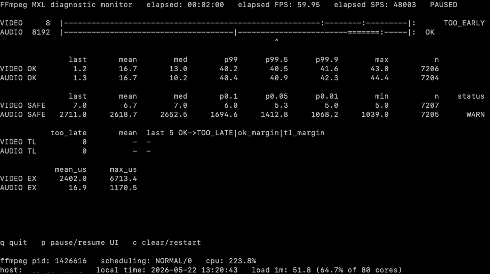

## Extract FFmpeg stage names and latency from logs.

The FFmpeg `-debug_ts` option logs timestamp information as packets
move through the processing pipeline. These timestamps can be used to
estimate the latency introduced by FFmpeg processing stages.

Run FFmpeg with `-log_level debug` and the `-debug_ts` option. About
15 seconds of log data is normally enough.

```
$ ffmpeg -loglevel debug -debug_ts ... > debug_ts.log 2>&1
```

Then run the `extract_stages.sh` script:

```
$ extract_stages.sh debug_ts.log
 ==== input side (demux->decode)
 == demux
[vist#0:0/v210 @ 0x5da879b18c80] demuxer ->
[vist#0:0/v210 @ 0x5da879b18c80] demuxer+ffmpeg ->
[vist#0:0/v210 @ 0x5da879b18c80] demuxer+tsfixup ->
[aist#1:0/pcm_f32le @ 0x5da879b1a100] demuxer ->
[aist#1:0/pcm_f32le @ 0x5da879b1a100] demuxer+ffmpeg ->
[aist#1:0/pcm_f32le @ 0x5da879b1a100] demuxer+tsfixup ->
== decode
[vist#0:0/v210 @ 0x5da879b18c80] [dec:v210 @ 0x5da879f743c0] decoder ->
==== output side (filter->encode->mux)
== filter
[vf#0:0 @ 0x5da879b4b740] filter ->
[vf#0:0 @ 0x5da879fce0c0] filter_raw ->
[af#0:1 @ 0x5da879c6ac80] filter_raw ->
== encode
[vost#0:0/h264_nvenc @ 0x5da879b2f440] [enc:h264_nvenc @ 0x5da879b2f980] encoder ->
[vost#0:0/h264_nvenc @ 0x5da879b2f440] [enc:h264_nvenc @ 0x5da879b2f980] encoder <-
[aost#0:1/libopus @ 0x5da879f83700] [enc:libopus @ 0x5da879b5f900] encoder ->
[aost#0:1/libopus @ 0x5da879f83700] [enc:libopus @ 0x5da879b5f900] encoder <-
== mux
[vost#0:0/h264_nvenc 0x5da879b2f440] muxer <- [count=465, median=5.060 p99=8.149 max=8.295 ms]
[aost#0:1/libopus @ 0x5da879f83700] muxer <- [count=1582, median=0.022 p99=0.387 max=0.607 ms]
```

The final `mux` section shows the latency statistics extracted from
the log. In the example above, `vost` is the video output stream and
`aost` is the audio output stream.

The video latency has a median of 5.060 ms, a 99th percentile of 8.149
ms, and a maximum of 8.295 ms measured over 465 packets. The audio
latency has a median of 0.022 ms, a 99th percentile of 0.387 ms, and a
maximum of 0.607 ms measured over 1582 packets.

Note that the script skips the first 200 and the last 20 packets to
avoid measuring startup and shutdown transients.  This is not
currently configurable. To change those values, look for the script
line:

```
echo "$id [$(./extract_stage_events.py "$stage" "$id" "$log" 200 20 --summary --outfile "${outfile}.m")]"
```

## Diagnostic Monitor

`ffmpeg_mxl_diag_monitor.py` is an experimental tool that connects to
the FFmpeg MXL demuxer diagnostic socket to display a live data
visualization of the audio and video MXL ring buffers and compute
buffer statistics.



The top VIDEO and AUDIO section provides a live preview of the active
MXL ring buffers.

{VIDEO,AUDIO}_OK provides statistics for the time between successful
MXL buffer reads. It provides information regarding operating system
scheduling variability.

{VIDEO,AUDIO}_SAFE provides statistics for the "safety margin" of
every successful MXL buffer read. Safety margin is defined by the
diagnostic monitor to be the number of video frames, or audio samples,
between the read index and the point at which an MXL TOO_LATE
condition will occur. Safety margin is a measure of how much
additional timing variation the ring buffer can absorb before the read
fails and data is lost.

In the video case the MXL API returns a TOO_LATE condition when the
read index is less than the tail of the ring buffer, hence the video
safety margin is: read_index - tail_index.

In the audio case the MXL API returns a TOO_LATE condition when the
read index is less than the midpoint of the ring buffer, hence the
safety margin is: read_index - (tail_index+head_index)/2.

The P columns are quantiles of the observed distribution. For example,
P99 is the 99th percentile, while P0.1 is the 0.1% quantile.

The `status` column shows "warn" when the safety margin is within two
video-frame periods of a TOO_LATE condition, and "critical" when it is
within one video-frame period.

{VIDEO,AUDIO}_TL is a record of the total number of TOO_LATE errors,
and provides a more detailed log of the last five TOO_LATE errors.

{VIDEO,AUDIO}_EX records the execution time of the FFmpeg MXL demuxer
read operation.
